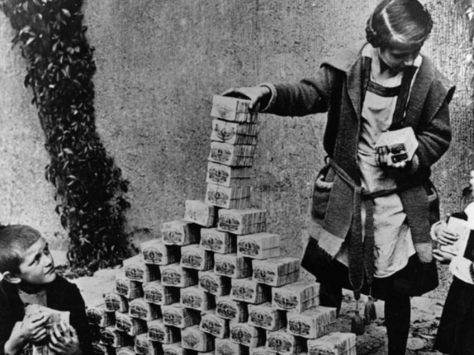
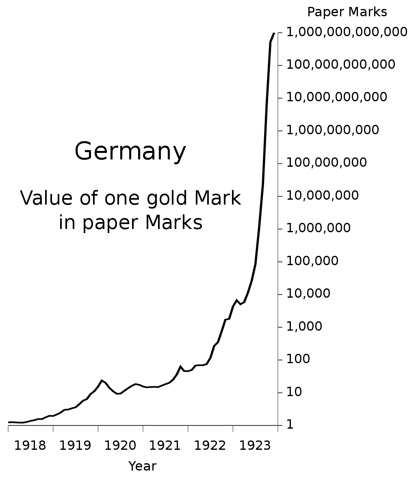

<https://www.youtube.com/watch?v=qYHOCbEekR0>

# Hyperinflation in the Weimar Republic

## Background

Germany suspended the gold standard when the IWW broke out. Unlike France, which imposed its first income tax to pay for the war, German Emperor Wilhelm II and the Reichstag decided unanimously to fund the war entirely by borrowing. The government believed that after winning the war they will pay the debts. Main idea was to annex resource-rich industrial territory of the nearby countries.

Fortunately Germans did not win the war, what lead in *Treaty of Versailles* to 33 billion USD reparations debt, later revised to 26.3 billion USD.

Because the Western Front of the war had been mostly fought in France and Belgium, Germany came out of the war with most of its industrial infrastructure intact, leaving it in a better position to become the dominant economic.

## War reparations
The first payment took place in June 1921, it was supposed to be paid in the hard currency, not at that time rapidly depreciating Papiermark. It was buying foreign currencies with marks for any price, what only increased the speed of the collapse in value of the mark.

first half of 1922: 320 marks per dollar.
December 1922: 7400 marks per dollar.

 By fall of 1922, Germany found itself unable to make reparations payments.

 

--- 
## Hyperinflation 

The strategy that Germany had been using to pay war reparations was the mass printing of bank notes to buy foreign currency, which was then used to pay reparations. Since the mark was, by fall of 1922, practically worthless, it was impossible for Germany to buy foreign exchange or gold using paper marks. 

After Germany failed to pay France an installment of reparations on time in late 1922, French and Belgian troops occupied the **Ruhr Valley**, Germany's main industrial region, in January 1923.

What only deepen the hyperinflation.

A loaf of bread in Berlin that cost around **160 marks** at the end of 1922 cost **200,000,000,000 marks** by late 1923.

## Fixing economy
Hans Luther proposed a plan that substituted gold for rye and led to the issuance of the Rentenmark, backed by bonds indexed to the market price of gold. The gold bonds were indexed at the rate of 2,790 gold marks per kilogram of gold.

